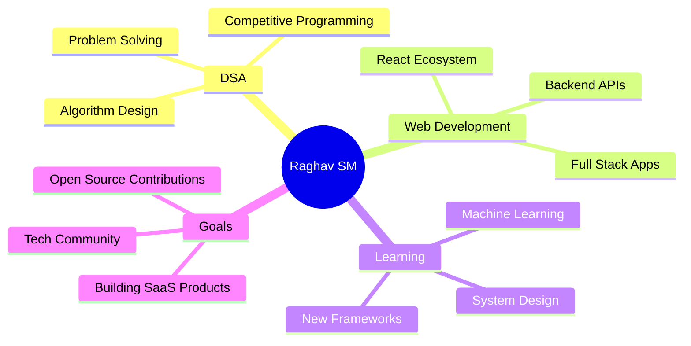

# Raghav SM

  
  
  
  
  
  
  

---

## 👨‍💻 About Me

I'm a **third-year engineering student** majoring in **Electronics**, but my true passion is **coding**. I love anything that involves **heavy logic and implementation** - the more challenging, the better!  

I've **committed** myself to exploring different technologies, from **Machine Learning** to **Java**, and I absolutely enjoy solving problems with **Data Structures and Algorithms**.  

**P.S. I might be an Electronics engineer by degree, but I bring more spark to my code than to my circuits!** ⚡😆 

---

## 🛠️ Tech Stack

### Languages
 
 
 
 

### Frontend
 
 
 
 
 

### Backend
 
 
 

### Databases & ORM
 
 
 

### Deployment & Cloud
 
 

### Tools & Design

 

---

## 📊 GitHub Analytics

  
  

  

  

---

## 🏆 GitHub Achievements

  

---

## 💼 Featured Projects

| Project | Description | Tech Stack | Links |
|---------|-------------|------------|-------|
| 🚀 **Portfolio Website** | Personal portfolio showcasing my projects and skills | React, Next.js, Tailwind CSS | [Live](https://portfolio.raghavsm.tech) |
| 📊 **Coming Soon...** | More exciting projects on the way! | Various technologies | 🔄 |

---

## 🎯 Current Focus & Interests

- 🔥 **Hardcore Coding** (definitely not design that's not my strong suit!)
- 🧮 **Data Structures & Algorithms** - solving complex problems daily
- 🌐 **Full-Stack Development** - building end-to-end applications
- 🤖 **Machine Learning** - exploring AI and ML concepts
- 🚀 **Performance Optimization** - making code run faster and better

---

## 📈 Coding Activity

<!--START_SECTION:waka-->
<!-- This section will be automatically updated if you set up WakaTime -->
<!--END_SECTION:waka-->

  

---

## 🤝 Let's Connect!

  
  
  
  
  

  ---
  
  ### 💡 Fun Fact: **"Prefix Sum is the best!"** 
  
  *Always open to interesting conversations about technology, coding challenges, or collaboration opportunities!*
  
  ⭐️ From [Raghav SM](https://github.com/Raghav-sm) with ❤️
  

